# Jenkins pipeline setup notes

### CI Pipeline diagram

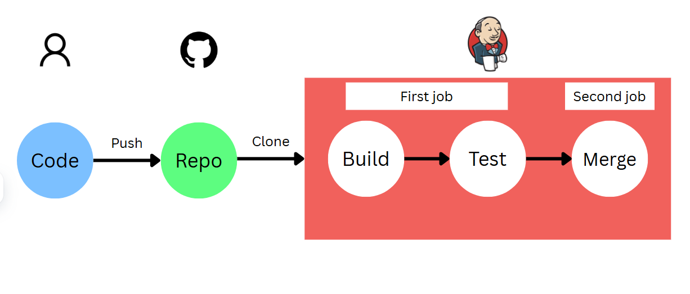

# CI - Continuous Integration

Before you start you should have a private Github repo setup with the unzipped files you need

## Creating a job

**In Jenkins:**

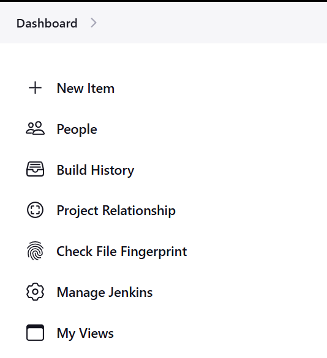

- New item
- Name: james-first-job (or similar)
- freestyle project
- Description: Just something descriptive
- Discard old build:
  - Max builds to keep: 3 (Saves the last 3 builds it created)
- Build steps:
  - Execute shell: (Works like user data. It is a bash script that is executed on startup)
- Build now

**To check the output of the execute shell:**

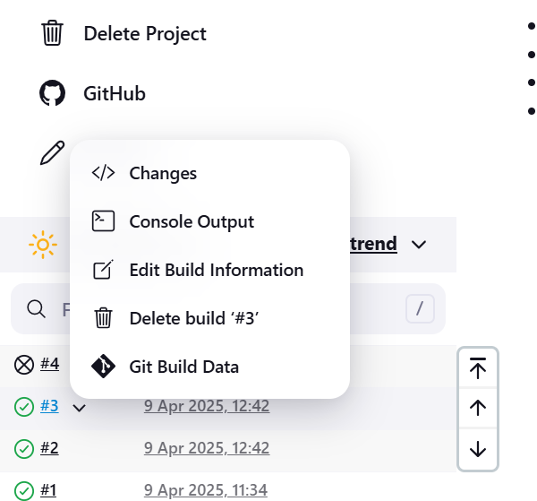

Select console output from the dropdown menu you get when hovering over the number. Below shows an example console output.

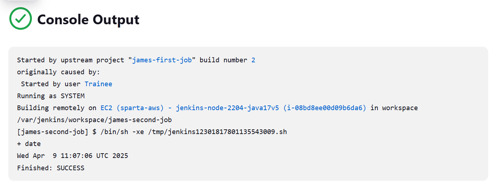

Go to dashboard to see all items

## Chaining jobs

If you have created 2 jobs, you can chain them together. This means that the second job will atomatically be built and tested after the first is complete.

- **Go to the first job**
- Configure
- Post build actions:
  - Build other projects:
    - Select the second job
    - Trigger only if build succesful

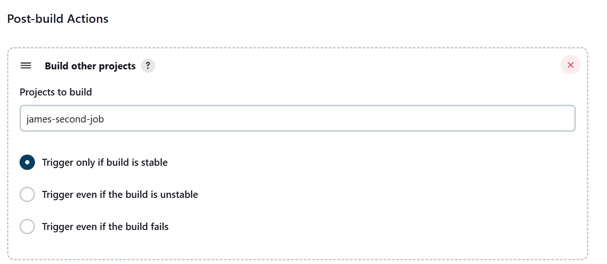

## Connecting to Github

**Connecting a key-pair to your Github repo**

- **In your .ssh folder in Git Bash**, create a new ssh key pair using the command:

```ssh-keygen -t rsa -b 4096 -C "placeholder@hotmail.com"```

- **Go to your Github repo**
- Settings:
  - Deploy keys: 
    - Add deploy key
    - Copy and paste the output from your public ssh key using ```cat public_key_name.pub```
    - Allow write access

**Connecting your Github repo to your Jenkins job**

When configuring your job **in Jenkins**:
- Select Github project:
  - Add your Github repo url from the search bar with ```/``` at the end as the url
  - 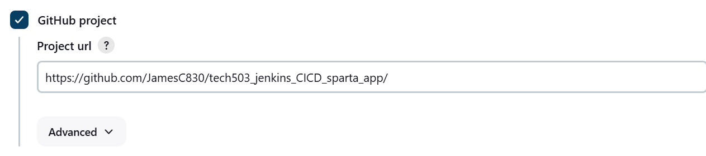
  - Source code management:
    - Git (see image below)
      - Repository URL: get this from the green code<> button on github, specifically the ssh key
      - 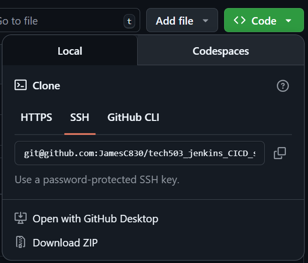
      - In credentials,select ssh username as kind. Put your private ssh key. This includes all the bits that the ```cat``` function pastes (i.e. the ```----Somethin-----``` at the top and bottom)
      - Branch specifier: ```*/dev``` for setting up webhook
- Build environment: 
  - Provide Node & npm bin/ folder to PATH
  - NodeJs version 20
- Build steps: (Specific to our app)
```
cd app
npm install
npm test
```

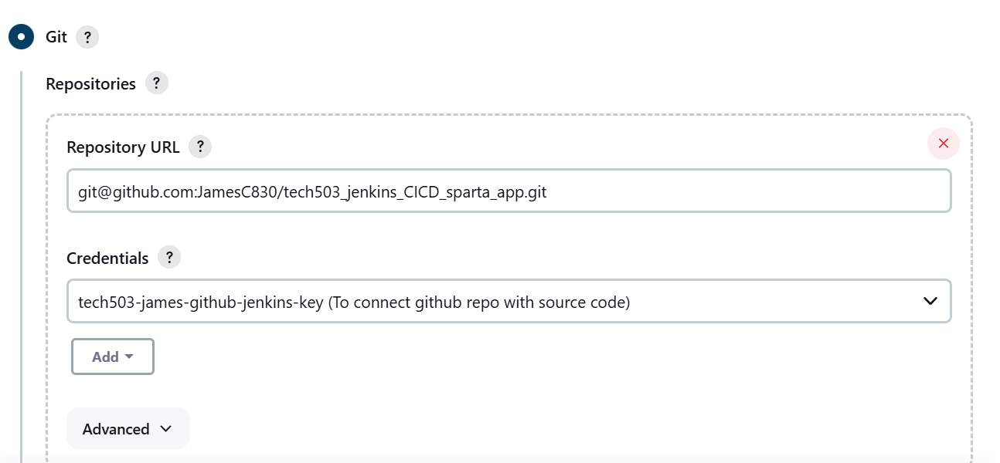


## Setting up a webhook

**Jenkins Job** Configure:
- Branch specifier: ```*/dev``` for setting up webhook
- Build triggers: GitHub hook trigger for GITScm polling

Back to the **Github repo**:
- Settings:
  - Add webhook:
    - Payload URL:
      - http://"Jenkins IP address and port"/github-webhook/
      - e.g. http://34.243.28.200:8080/github-webhook/
    - SSL verification: Disable (Only for testing, not good practice)

Back to **local git repo**:
- Switch to the dev branch: ```git checkout -b dev```
- Make a change (e.g. to README)
- Push to github: ```git push -u origin dev```

## Setting up a merge

Make a **second Jenkins job**:
- Name: james-job2-ci-merge-test
- Copy from: your first job (e.g. james-job1-ci-test) which duplicates the first job
- Settings to change:
  - Remove build trigger
  - Remove build steps
  - Post build action:
    - Git publisher
    - Push only if build succeeds
    - Merge results
    - Add branch:
      - To push: main
      - Remote name: origin
- Save

Go to the **first job**:
- Configure
- Post build actions:
  - Build job 2
  - Trigger only if stable

To check if it has succeeded, go to your **Github repo**. Main should be up to date with the dev branch.

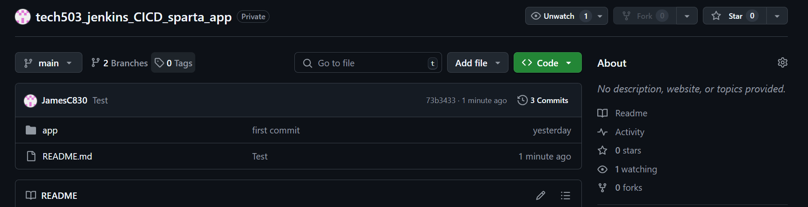

# CDE -Continuous deplyment

Make **EC2 instanc**e to host deployed app:
- Name: tech503-james-cde-test
- Images: Use app image
- Key-pair: The usual
- Security group: Basic (Ports 22 and 80)
- No user data as Jenkins runs the commands

In a **3rd Jenkins job**:
- New item
- Name: james-job3-cde-test
- Copy from: your 2nd job (james-job2-ci-merge-test)
- Changes:
  - Branch specifier: main
  - Build environment: Add SSH agent
    - (Here you add your private aws ssh key)
    - SSH username
    - ID: tech503-james-aws-key
    - Username can be the same as ID
    - Enter directly: result of ```cat tech503-james-aws-key.pem```
  - Remove post build action
  - Remove build steps
  - Add new build step:
    - Execute shell: DNS needs to be changed in the below

```
rsync -avz -e "ssh -o StrictHostKeyChecking=no" app ubuntu@DNS:/home/ubuntu
ssh -o "StrictHostKeyChecking=no" ubuntu@DNS <<EOF
   cd app
   npm install
   pm2 kill
   pm2 start app.js
EOF
```

Highlighted in the image below is the DNS

Public IP may work as well

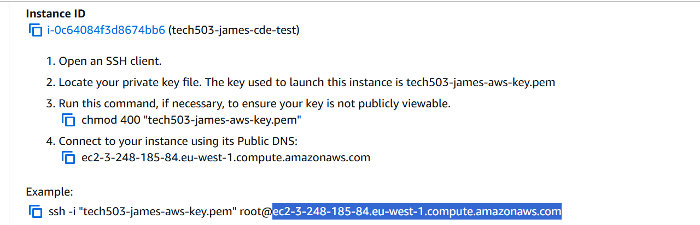

Go to **2nd job**:
- Configure
- Post build actions:
  - Build other projects:
    - Add job 3
    - Put this to the bottom of the queue of post build action

To test it works go to **local git repo**:
- app -> views -> nano index.ejs
- Change either the image or line 27 text
- Do a git push

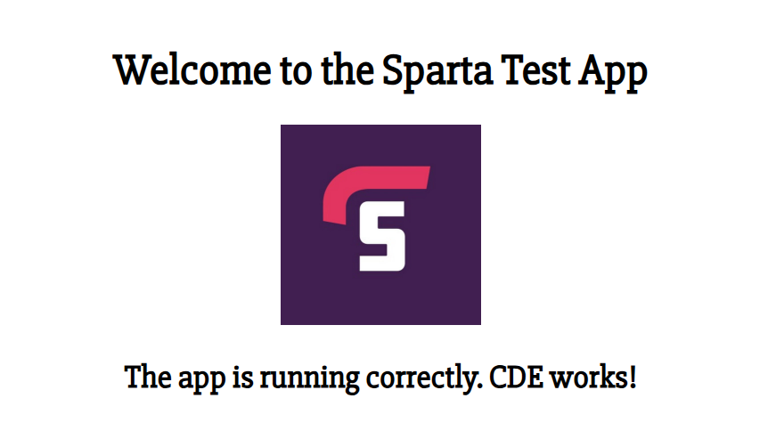


