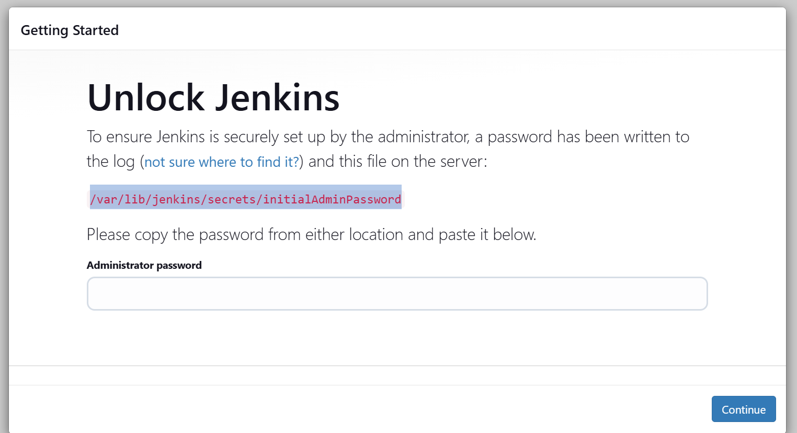
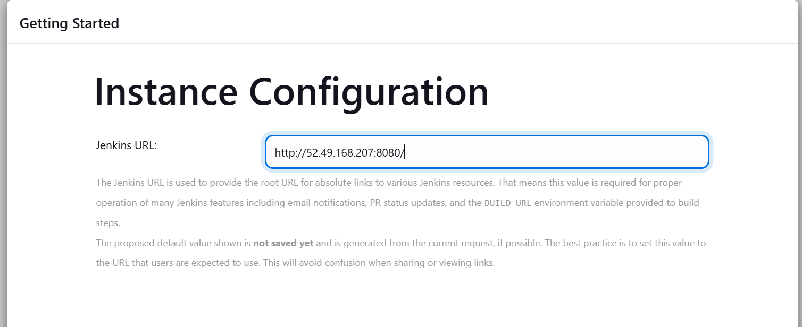
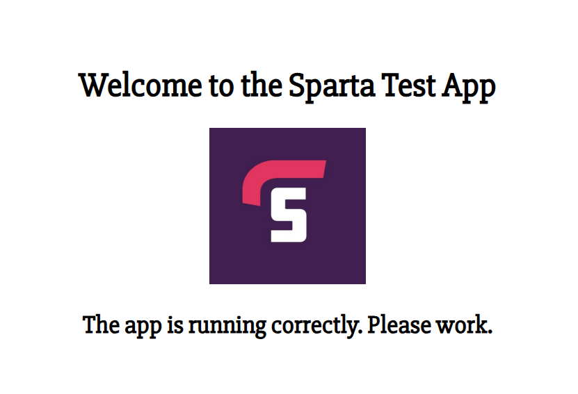

# Jenkins server setup

- Setup a VPC using [VPC notes](https://github.com/JamesC830/tech_503_cloud_comp_notes/blob/main/VPCs_notes.md)

Jenkins EC2 instance:
- Ubuntu 22
- Instance type: Use t2.micro or t3.micro size
- Usual key pair
- Security group:
  - Name: tech503-james-jenkins-sg
  - Ports: 22, 80 and 8080 (Jenkins runs on port 8080)
- Connect to VPC: To do this, use VPCs_notes
- Launch instance

When logged in to the instance in git:
Upgrage and update
```
#!/bin/bash

#Avoid purple screen
sudo sed -i 's/#$nrconf{restart} = '"'"'i'"'"';/$nrconf{restart} = '"'"'a'"'"';/g' /etc/needrestart/needrestart.conf

#update
sudo apt update -y

#upgrade add fix/mitigate
sudo NEEDRESTART_MODE=a apt-get dist-upgrade --yes
```

[Jenkins Documentation](https://www.jenkins.io/doc/book/installing/linux/)

**Install jenkins**
```
#Import GPG key
sudo wget -O /usr/share/keyrings/jenkins-keyring.asc \
  https://pkg.jenkins.io/debian-stable/jenkins.io-2023.key

#Add the Jenkins apt repository:
echo "deb [signed-by=/usr/share/keyrings/jenkins-keyring.asc]" \
  https://pkg.jenkins.io/debian-stable binary/ | sudo tee \
  /etc/apt/sources.list.d/jenkins.list > /dev/null

#Update and install
sudo apt-get update
sudo apt-get install jenkins -y
```

**Install Java**
```
sudo apt update
sudo apt install fontconfig openjdk-17-jre -y
java -version
```

Expected output of ```java -version```
```
openjdk version "17.0.13" 2024-10-15
OpenJDK Runtime Environment (build 17.0.13+11-Debian-2)
OpenJDK 64-Bit Server VM (build 17.0.13+11-Debian-2, mixed mode, sharing)
```

**Start Jenkins**
```
sudo systemctl enable jenkins
sudo systemctl start jenkins
```

**Start jenkins on the web**
i.e. Put public-ip:8080 into the search bar

Result screen


In **git bash**:
- Get the Admin password: ```sudo cat /var/lib/jenkins/secrets/initialAdminPassword```
- Paste the result

**In web Jenkins: Select plugins**
- Install suggested pluggins
- Add the extra ones we need later

**Create first admin user**
Username: tech503-james
Password: Your password ending in 9?

**Follow url to login**


Follow url: http://52.49.168.207:8080/

**Manage Jenkins -> Installed plugins**
- We need to add new pluggins
- NodeJS
- SSH Agent

**Security settings**:
- Manage Jenkins -> Security
- Git Host Key Verification Configuration
- No verification (Not reccomended)

**Tools**
- Manage Jenkins -> Tools
- Add NodeJS version 20.19.0

**From here, set up the jobs as in [Jenkins pipeline](https://github.com/JamesC830/tech503_CICD_notes/blob/main/Jenkins_pipeline_setup.md)**

### Victory is mine




